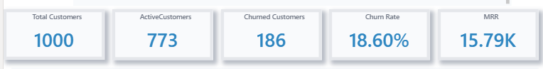
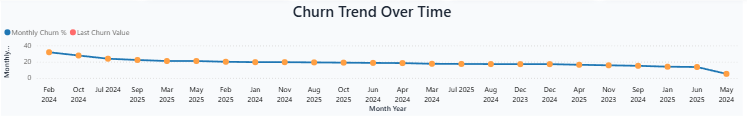
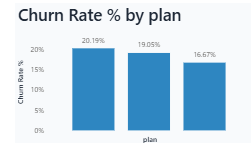
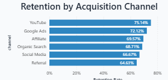
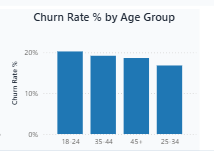

# Streamify Customer Churn & Retention Analytics

## Objective
This project analyzes customer churn patterns and retention behavior for **Streamify**, a subscription-based streaming platform.  
The goal is to identify **drivers of churn**, determine **high-risk customer segments**, and propose strategies to **improve retention and revenue stability**.

---
## Project Structure

```
Streamify-Churn-Analytics/
│
├── Dashboard/               # Power BI dashboard (.pbix)
├── Queries/                 # SQL scripts used for data analysis
├── Data/                    # Dataset (sample/raw, if included)
└── Visuals/                 # Dashboard screenshots
```

---

## Dashboard Preview
| KPI Overview                         | Churn Trend                             | Churn by Plan                               | Retention by Channel                                     | Churn by Age Group                        |
|--------------------------------------|-----------------------------------------|---------------------------------------------|----------------------------------------------------------|-------------------------------------------|
|  |  |  | |  |

--- 

## Key Insights

- The overall **churn rate is 18.6%**, which means nearly **1 in 5 customers discontinue** the service.
- **Churn is gradually decreasing** month-over-month, indicating improved product experience or retention strategy impact.
- The **Pro plan shows the highest churn (~20%)**, suggesting lower perceived value after upgrade.
- Customers acquired through **YouTube and Google Ads** demonstrate **stronger retention (≥75%)**, making them the **highest-value acquisition channels**.
- The **18–24 age segment has the highest churn**, likely due to price sensitivity and shorter subscription commitment behavior.
- Strengthening **first 30-day onboarding and engagement** presents a key opportunity to reduce churn.

--- 

## SQL Logic Summary

- Joined **customer**, **subscription**, and **payment** tables to analyze the complete subscription lifecycle.
- Classified churn based on subscription status:
  ```sql
  status IN ('cancelled', 'expired') → Churned  
  status = 'active' → Retained


---

## Key DAX Measures (Power BI)

```DAX
Total Customers =
DISTINCTCOUNT(Customers[customer_id])

Active Customers =
CALCULATE(
    DISTINCTCOUNT(Subscriptions[customer_id]),
    Subscriptions[status] = "active"
)

Churned Customers =
CALCULATE(
    DISTINCTCOUNT(Subscriptions[customer_id]),
    Subscriptions[status] <> "active"
)

Churn Rate % =
DIVIDE([Churned Customers], [Total Customers], 0)

MRR =
CALCULATE(
    SUM(Payments[amount]),
    Subscriptions[status] = "active"
)

Revenue Lost Due to Churn =
CALCULATE(
    SUM(Payments[amount]),
    Subscriptions[status] <> "active"
)
```


## Tools Used

| Tool / Technology     | Purpose |
|-------------------|---------|
| **Power BI Desktop** | Designed visual dashboards and interactive reports |
| **Power Query (Power BI)** | Cleaned, shaped, and transformed raw data before modeling |
| **DAX (Data Analysis Expressions)** | Created calculated measures (Churn Rate %, Retention %, MRR, Revenue Loss, etc.) |
| **MySQL** | Performed data extraction, joins, segmentation, and KPI calculations |
| **Excel / CSV** | Initial dataset exploration and preprocessing |
| **Git & GitHub** | Version control, documentation, and project portfolio showcase |


--- 

##  Outcome & Business Value This analytics system provides strategic clarity to: 
-Reduce churn by improving onboarding and value communication
-Strengthen **Pro plan value positioning
-Prioritize **high-retention acquisition channels*
-Design **targeted retention programs** for vulnerable age segments
  
